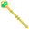
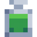
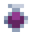
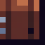
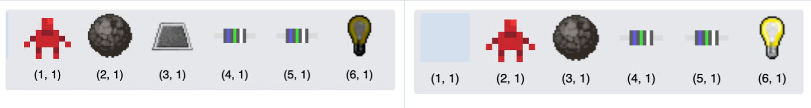

# Assignment Specification

> This page contains the tasks you’ll need to complete for this assignment, and how you’ll be assessed.

[[_TOC_]]

# 1. Getting Started

You can access your pair repository via the following URL:

`https://nw-syd-gitlab.cseunsw.tech/COMP2511/23T3/teams/YOUR_TEAM_NAME/assignment-ii`

Replace `YOUR_TEAM_NAME` with your team name (e.g. `M18A_JIGGLYPUFF`)

> For this assignment, you will need to make two sets of blog posts and add these to your repo: <br>
> - Your pair blog post, which contains the answers to these questions and links to your code changes.
> - Your individual blog post, which serves as a record of your individual contribution. 
> [You can view instructions and templates for this blogging here](/Blog_Instructions.md).


# 2. Tasks

> Important Breadcrumbs…
> This Assignment has three tasks. However, we recommend you read the whole spec before starting Task 1. Parts of different tasks may affect how you complete the assignment. Follow the trail of breadcrumbs that leads to Task 3…

## Task 1) Code Analysis and Refactoring (40 marks) ⚙️

In this task, you will need to analyse the design of the monolith, including the patterns and smells present in the implementation, and apply refactoring techniques discussed in the course in order to improve the quality of the code.

> ### Instructions for Task 1:
>
> Put all of your answers to the following theory questions in your **pair blog post**.
>
> For each refactoring change, **before you start coding** take some time to plan and write up a design in your pair blog post. This should include:
>
> - What fields/methods you will need to add/change in a class
> - What new classes/packages you will need to create
>
> **After you finish coding**, make a Merge Request into the `master` branch of your repository with the following:
>
> - A meaningful MR title that encompasses the changes
> - A brief description which outlines the changes being made
> - Make sure to keep the MR as small as possible - don't make any extra changes that aren’t absolutely necessary. Try to keep the number of files the changes touch to a minimum.
> - Make sure all the Continuous Integration checks (regression tests, linting, coverage) remain passing.
>
> Your partner will need to **code review** and either:
>
> - Leave comments in the MR with things to fix (you can do code reviews sync or async), requiring you to **iterate on the MR** and **resubmit** for review; or
> - Approve the MR.
>
> Once the MR is approved, copy and paste the link to your MR into your blog post.
>
> Make sure to do this for each part of the question - **if you don't you will lose marks**.

### a) From DRY to Design Patterns (7 marks)

i. Look inside src/main/java/dungeonmania/entities/enemies. Where can you notice an instance of repeated code? Note down the particular offending lines/methods/fields.

ii. What Design Pattern could be used to improve the quality of the code and avoid repetition? Justify your choice by relating the scenario to the key characteristics of your chosen Design Pattern.

iii. Using your chosen Design Pattern, refactor the code to remove the repetition.

### b) Observer Pattern (5 marks)

Identify one place where the Observer Pattern is present in the codebase, and outline how the implementation relates to the key characteristics of the Observer Pattern.

### c) Inheritance Design (6 marks)

Currently, there is a significant flaw in the inheritance structure of entities.

Consider the following three methods in the Exit entity class.

```
@Override
public void onOverlap(GameMap map, Entity entity) {
    return;
}

@Override
public void onMovedAway(GameMap map, Entity entity) {
    return;
}

@Override
public void onDestroy(GameMap gameMap) {
    return;
}
```

i. Name the code smell present in the above code. Identify all subclasses of Entity which have similar code smells that point towards the same root cause.

ii. Redesign the inheritance structure to solve the problem, in doing so remove the smells.

### d) More Code Smells (6 marks)

The previous engineering team has left you with the following note:

> Collectable entities are a big problem. We tried to change the way picking up items is handled, to be done at the player level instead of within the entity itself but found that we had to start making changes in heaps of different places for it to work, so we abandoned it.

i. What code smell is present in the above description?

ii. Refactor the code to resolve the smell and the underlying problem causing it.

### e) Open-Closed Goals (6 marks)

Look inside the goals package at the code provided.

i. Do you think the design is of good quality here? Do you think it complies with the open-closed principle? Do you think the design should be changed?

ii. If you think the design is sufficient as it is, justify your decision. If you think the answer is no, pick a suitable Design Pattern that would improve the quality of the code and refactor the code accordingly.

### f) Open Refactoring (10 marks)

Make any other refactoring improvements you see fit to the codebase. This can include resolving Design Smells, using Design Patterns discussed or any other general improvements to the health and quality of the code.

Some areas and questions you can consider:

- Look for violations of the Law of Demeter/Liskov Substitution Principle;

- The effects of potions (invisibility and invincibility) has been implemented using a State Pattern. However, the State Pattern hasn't been used particularly effectively here and as a result, there is poor design.

- The current implementation of buildable entities contains a significant amount of hard coding. Think about how you can improve this.

The above list isn’t exhaustive; there are plenty of other areas to improve the quality of the code.

> Don't make solutions to problems that don’t exist yet! :) Avoid over-engineering or over-abstracting in places where you might want to improve the design for some future change in requirements - instead improve the design of the current system. This will inherently make your software open-closed.
>
> You’ll also want to split this task into one MR for each refactoring change you make.

## Task 2) Evolution of Requirements (50 marks)

In this task, you and your partner/group will need to complete **Part A - Microevolution and the same number of the following tasks as there are members in your group**:

b) Bosses (10 marks)

c) Swamp Tile (10 marks)

d) Sunstone & More Buildables (15 marks)

e) Snakes (15 marks)

f) Logic Switches (20 marks)

E.g. If there are two of you, you need to pick two of the above tasks, if there are three of you, you pick three. Each task has a different mark allocation based on its difficulty. You should pick tasks you feel comfortable completing. If you complete extra tasks, that is fine - we will take your performance in the best N tasks, where N is the number of people in your team.

If you are in a group of 3, your mark will be out of 65 and scaled to 50.

Write all your tests for this question inside the `task2` folder.

### Software Delivery - Task Lifecycle

For each part of this task, you will need to undertake the following process. This will help your tutor assess your design during marking.

1.  **Requirements Engineering**. Analyse the task requirements, including the technical and product specifications. If you need to, make some assumptions and document these in your pair blog post.
2.  **Detailed Design**. In your pair blog post, plan out a detailed design for the task. This should include:
    - What fields/methods you will need to add/change in a class
    - What new classes/packages you will need to create
3.  **Design Review**. Have your partner review the design, and go back and iterate on the design if needed.
4.  **Create a Test List**. Once the design is approved, write a **test list** (a list of all the tests you will write) for the task. Map out each of the conceptual cases you want to test. This can be written in your blog post, or if you want make function stubs for JUnit tests and put up a Merge Request (link in your blog).
5.  **Test List Review**. Have someone else in your team review the test list to make sure the test cases all make sense and cover the input space.
6.  **Create the Skeleton**. Stub out anything you need to with class/method prototypes.
7.  **Write the tests**, which should be failing assertions currently since the functionality hasn't been implemented.
8.  **Development**. Implement the functionality so that your tests pass.
9.  Run a **usability test** (check your functionality works on the frontend).
10. Where needed, **refactor** your code to improve the style and design while keeping the tests passing.
11. Put up a **merge request** with your changes into master. The CI should be passing. The merge request should have a meaningful title and contain a description of the changes you have made. In most cases you should just be able to link them to your design/test list blog.
12. **Code Review** from your partner, iterate where needed then they should approve the MR.

Feel free to split tasks further where you see fit, especially for larger tasks (e.g. Logic Switches). Keep your Merge Requests small and make the iteration cycle short, incrementally building your MVP as you go.

> 💡 If you've done Task 1 well and have a nice healthy codebase, this task should be relatively straightforward! If you're finding parts of this task difficult to integrate with the existing design, that's probably a sign you need to do some more refactoring :)

> ♻️ A note about **backwards compatibility**:
>
> - **All** the regression tests we have provided to you in the starter code should remain passing.
> - All of the MVP configuration files (in the provided config files) do not currently contain the fields listed in the technical specifications for Tasks 2a)-f). Rather than retroactively adding these fields to the existing configuration files, you will need to design your implementation to accomodate for this and maintain backwards compatibility. **All configuration files in our Task 2 autotests will contain all values from Task 2** and the MVP.

### a) Microevolution - Enemy Goal (15 marks)

In this section you will need to make a small-scale addition to the code based on the following new requirements.

The following new goal has been introduced:

- Destroying a certain number of enemies (or more) AND all spawners;

Other goal rules, including rules of conjunction/disjunction and exits must be completed last, still apply.

#### Technical Specification

"enemies" is now included in the list of goals specified in 4.1.3. of the MVP specification.

The list of configuration fields in Section 4.2.1. of the MVP specification now includes the following fields:

<table>
<thead>
  <tr>
    <th style="font-weight:bold">JSON Format<br></th>
    <th style="font-weight:bold">Description</th>
  </tr>
</thead>
<tbody>
  <tr>
    <td> <code>enemy_goal</code>
  </td>
    <td>At least x enemies must be killed to complete the enemy goal.</td>
  </tr>
</tbody>
</table>

### b) Bosses (10 marks)

In this task, you need to implement the following new entities.

Bosses are moving entities which are harder to defeat/conquer than normal enemies.

<table>
<thead>
  <tr>
    <th><span style="font-weight:bold">Entity</span></th>
    <th><span style="font-weight:bold">Image</span></th>
    <th><span style="font-weight:bold">Description</span></th>
  </tr>
</thead>
<tbody>
  <tr>
    <td>Assassin</td>
    <td></td>
    <td>Assassins are exceptionally powerful mercenaries which deal significantly more damage. When bribing an Assassin, there is a certain chance that the bribe will fail; the gold will be wasted and the Assassin will remain hostile. Battles still do not occur with an Assassin when the player is invisible.</td>
  </tr>
  <tr>
    <td>Hydra</td>
    <td></td>
    <td>Hydras are generally considered to be a special creatures similar to Zombies. Hydras are limited by the same movement constraints as Zombies. In each round, when a hydra is attacked by the player, there is a certain chance that its health will increase rather than decrease by the given amount, as two heads have grown back when one is cut off.</td>
  </tr>
</tbody>
</table>

#### Technical Specification

The list of inputs in Section 4.1.1. of the MVP specification now includes the following entities:

<table>
<thead>
  <tr>
    <th>Entity</th>
    <th>JSON Prefix</th>
    <th>Creatable from Dungeon Map?</th>
  </tr>
</thead>
<tbody>
  <tr>
    <td>Assassin</td>
    <td>
    <code>assassin</code>
  </td>
    <td>Yes</td>
  </tr>
  <tr>
    <td>Hydra</td>
    <td>
    <code>hydra</code>
  </td>
    <td>Yes</td>
  </tr>
</tbody>
</table>

The list of configuration fields in Section 4.2.1. of the MVP specification now includes the following fields:

<table>
<thead>
  <tr>
    <th style="font-weight:bold">JSON Format<br></th>
    <th style="font-weight:bold">Description</th>
  </tr>
</thead>
<tbody>
  <tr>
    <td> <code>assassin_attack</code>
  </td>
    <td>Attack damage of the assassin.</td>
  </tr>
    <tr>
    <td> <code>assassin_bribe_amount</code>
  </td>
    <td>The amount of gold required to perform an attampt to bribe an assassin.</td>
  </tr>
  <tr>
    <td> <code>assassin_bribe_fail_rate</code>
  </td>
    <td>The chance that the bribe on an assassin will fail. The value of this field should be always inclusively between 0 and 1.</td>
  </tr>
  <tr>
    <td> <code>assassin_health</code>
  </td>
    <td>Health of the assassin.</td>
  </tr>
  <tr>
    <td> <code>hydra_attack</code>
  </td>
    <td>Attack of the hydra.</td>
  </tr>
  <tr>
    <td> <code>hydra_health</code>
  </td>
    <td>Health of the hydra.</td>
  </tr>
  <tr>
    <td> <code>hydra_health_increase_rate</code>
  </td>
    <td>The chance that the health of a Hydra increases when it gets attacked each round. The value of this field should be always inclusively between 0 and 1.</td>
  </tr>
  <tr>
    <td> <code>hydra_health_increase_amount</code>
  </td>
    <td>The amount the health of a Hydra increases by when it gets attacked.</td>
  </tr>
</tbody>
</table>

### c) Swamp Tile (10 marks)

As part of this, you will need to extend your solution to accommodate the idea of a **swamp tile**. These are tiles that have an x and y position and remain fixed throughout the entire game. They slow the movement of all entities through them, except for the player and allies adjacent to the player. Each swamp file has a movement factor which is a multiplying factor of the number of ticks it takes to traverse the tile. For example, let us say the movement factor for a swamp tile is 2:

- Tick 1: Move onto the swamp tile;
- Tick 2: Stuck on the swamp tile;
- Tick 3: Still stuck on the swamp tile;
- Tick 4: Move off the swamp tile.

Mercenaries should now take the slowing effect of swamp tiles into account when pathfinding to the player.

<table>
<thead>
  <tr>
    <th><span style="font-weight:bold">Entity</span></th>
    <th><span style="font-weight:bold">Image</span></th>
  </tr>
</thead>
<tbody>
  <tr>
    <td>Swamp tile</td>
    <td></td>
  </tr>
</tbody>
</table>

#### Technical Specification

The list of inputs in Section 4.1.1. of the MVP specification now includes the following entities:

<table>
<thead>
  <tr>
    <th>Entity</th>
    <th>JSON Prefix</th>
    <th>Creatable from Dungeon Map?</th>
  </tr>
</thead>
<tbody>
  <tr>
    <td>Swamp tile</td>
    <td>
    <code>swamp_tile</code>
  </td>
    <td>Yes</td>
  </tr>
</tbody>
</table>

All swamp tiles will be created with a field `movement_factor` which will be the tile's movement factor, an integer >= 0.

### d) Sun Stone & More Buildables (15 marks)

In this task, the following collectable entities need to be added:

<table>
<thead>
  <tr>
    <th><span style="font-weight:bold">Entity</span></th>
    <th><span style="font-weight:bold">Image</span></th>
    <th><span style="font-weight:bold">Description</span></th>
  </tr>
</thead>
<tbody>
  <tr>
    <td>Sun Stone</td>
    <td></td>
    <td>A special form of treasure, hard and treasuable. It can be picked up by the player. Can be used to open doors. Can also be used interchangeably with treasure or keys when building entities, though if the player possesses enough treasure or keys those should be preferred when crafting. But it cannot be used to bribe mercenaries or assassins. Since it is classed as treasure it counts towards the treasure goal. When used for opening doors, or when replacing another material such as a key or treasure in building entities, it is retained after use. When used as a listed ingredient in crafting, it is consumed.</td>
  </tr>
</tbody>
</table>

The following buildable entities have also been added:

<table>
<thead>
  <tr>
    <th><span style="font-weight:bold">Entity</span></th>
    <th><span style="font-weight:bold">Image</span></th>
    <th><span style="font-weight:bold">Description</span></th>
  </tr>
</thead>
<tbody>
  <tr>
    <td>Sceptre</td>
    <td></td>
    <td>Can be crafted with (1 wood OR 2 arrows) + (1 key OR 1 treasure) + (1 sun stone). A character with a sceptre does not need to bribe mercenaries or assassins to become allies, as they can use the sceptre to control their minds without any distance constraint. But the effects only last for a certain number of ticks. This number of ticks begins counting down immediately after the sceptre is used.
    <details margin-top="10px">
        <br>
        <summary>Example</summary>
        In a case where the sceptre's duration is 2 ticks:
        <ul>
            <li>Tick 1 - player's turn: Player mind controls enemy. </li>
            <li>Tick 1 - enemy's turn: Enemy is mind controlled. </li>
            <li>Tick 2 - player's turn: Player moves. </li>
            <li>Tick 2 - enemy's turn: Enemy is mind controlled. </li>
            <li>Tick 3 - player's turn: Player moves. </li>
            <li>Tick 3 - enemy's turn: Enemy is no longer mind controlled. </li>
        </ul>
        </details>
    <br>
   </td>
  </tr>
    <tr>
    <td>Midnight Armour</td>
    <td></td>
    <td>Can be crafted with (1 sword + 1 sun stone) if there are no zombies currently in the dungeon. Midnight armour provides extra attack damage as well as protection, and it lasts forever.</td>
  </tr>

</tbody>
</table>

#### Technical Specification

The list of inputs in Section 4.1.1. of the MVP specification now includes the following entities:

<table>
<thead>
  <tr>
    <th>Entity</th>
    <th>JSON Prefix</th>
    <th>Creatable from Dungeon Map?</th>
  </tr>
</thead>
<tbody>
  <tr>
    <td>Sun Stone</td>
    <td>
    <code>sun_stone</code>
  </td>
    <td>Yes</td>
  </tr>

  <tr>
    <td>Sceptre</td>
    <td>
    <code>sceptre</code>
  </td>
    <td>No, since this entity must be built by the player.</td>
  </tr>
  <tr>
    <td>Midnight Armour</td>
    <td>
    <code>midnight_armour</code>
  </td>
    <td>No, since this entity must be built by the player.</td>
  </tr>
</tbody>
</table>

The list of configuration fields in Section 4.2.1. of the MVP specification now includes the following fields:

<table>
<thead>
  <tr>
    <th style="font-weight:bold">JSON Format<br></th>
    <th style="font-weight:bold">Description</th>
  </tr>
</thead>
<tbody>
  <tr>
    <td> <code>mind_control_duration</code>
  </td>
    <td>The amount of time mind controlling via a sceptre lasts for.</td>
  </tr>
  <tr>
    <td> <code>midnight_armour_attack</code>
  </td>
    <td>Attack bonus wearing midnight armour gives to the player.</td>
  </tr>
  <tr>
    <td> <code>midnight_armour_defence</code>
  </td>
    <td>Defence bonus wearing midnight armour gives to the player.</td>
  </tr>
</tbody>
</table>

The following interface methods in Section 4.3.2. of the MVP specification are now updated:

<table>
<thead>
  <tr>
    <th style="font-weight:bold">Method Prototype<br></th>
    <th style="font-weight:bold">Description<br></th>
    <th style="font-weight:bold">Exceptions<br></th>
  </tr>
</thead>
<tbody>
</tbody>
  <tr>
    <td><code>public DungeonResponse build(String buildable) throws InvalidActionException</code</td>
    <td>
    Builds the given entity, where buildable is one of <code>bow</code>, <code>shield</code>, 🆕<code>sceptre</code>, or 🆕<code>midnight_armour</code>
    </td>
    <td>
    IllegalArgumentException:
    <ul><li>If <code>buildable</code> is not one of <code>bow</code>, <code>shield</code>, 🆕<code>sceptre</code>, or 🆕<code>midnight_armour</code></li></ul> <br>
    InvalidActionException:
    <ul><li>If the player does not have sufficient items to craft the buildable, 🆕or unbuildable for <code>midnight_armour</code> because there are zombies currently in the dungeon.</li></ul>
    </td>
  </tr>
  <tr>
    <td><code>public DungeonResponse interact(String entityId) throws IllegalArgumentException</code</td>
    <td>
    Interacts with a mercenary (where the Player bribes 🆕or mind controls the mercenary) or a zombie spawner, where the Player destroys the spawner.
    </td>
    <td>
    IllegalArgumentException:
    <ul>
    <li> If <code> entityId</code> is not a valid entity ID</li></ul><br>
    </ul>
    InvalidActionException:
    <ul>
    <li>If the player is not within specified bribing radius to the mercenary, when they are bribing</li>
    <li>🆕If the player does not have enough gold and does not have a sceptre and attempts to bribe/mind-control a mercenary</li>
    <li>If the player is not cardinally adjacent to the spawner, if they are destroying a spawner</li>
    <li> If the player does not have a weapon and attempts to destroy a spawner</li>
    </ul>
    </td>
  </tr>
</table>

### e) Snakes (15 marks)

Snakes are enemies that are multiple tiles long.

<table>
<thead>
  <tr>
    <th><span style="font-weight:bold">Entity</span></th>
    <th><span style="font-weight:bold">Image</span></th>
    <th><span style="font-weight:bold">Description</span></th>
  </tr>
</thead>
<tbody>
  <tr>
    <td>Snake Head</td>
    <td></td>
    <td>All snakes have heads. The head of the snake determine the direction of movement. 
</td>
  </tr>
  <tr>
    <td>Snake Body</td>
    <td></td>
    <td>Snakes have zero or more body parts which follow the head in a line.</td>
  </tr>
</tbody>
</table>

Snakes are always created with a length of 1 (the head only). They can travel through all entities except for walls, themselves, and other snakes.

Snakes have a varied diet - they eat treasure, keys, arrows, and potions. Snakes take the shortest path towards the nearest piece of food - if there are two equally near pieces, it can choose either one. If the snake cannot reach any food, they go into a state of hibernation and remain still.

Players can battle any part of the snake. If the head of the snake is killed, the whole snake dies. Otherwise, if a body part is killed, all body parts following that body part also die. The head of the snake and any remaining body parts survive and can continue.

When a snake consumes a piece of food, two things immedately happen.

1. The snake grows 1 tile longer. The new body part is attached to the end of the snake, in the previous position of the tail.
2. The snake gains a buff depending on the type of food consumed. These buffs stack and last forever, including potions, and apply to the entire snake.

<table>
<thead>
  <tr>
    <th><span style="font-weight:bold">Food item</span></th>
    <th><span style="font-weight:bold">Image</span></th>
    <th><span style="font-weight:bold">Effect</span></th>
  </tr>
</thead>
<tbody>
  <tr>
    <td>Treasure</td>
    <td></td>
    <td>The snake gains a set amount of health.</td>
  </tr>
  <tr>
    <td>Key</td>
    <td></td>
    <td>The snake gains a multiplicative bonus to its health.</td>
  </tr>
  <tr>
    <td>Arrow</td>
    <td></td>
    <td>The snake gains a set amount of attack.</td>
  </tr>
  <tr>
    <td>Invisibility Potion</td>
    <td></td>
    <td> The snake can travel through walls and other snakes. It still cannot travel through itself.</td>
  </tr>
  <tr>
    <td>Invincibility potion</td>
    <td></td>
    <td>If a snake body part is killed, any body parts following it forms a new snake, with the segment after the killed part becoming the new head. The new snake is created with the current buffs of the existing snake (including the invincibility effect), but otherwise behaves independently, immediately on the tick it was created. Killing the snake's head functions the same as usual. </td>
  </tr>
</tbody>
</table>

#### Technical specification

The list of inputs in Section 4.1.1. of the MVP specification now includes the following entities:

<table>
<thead>
  <tr>
    <th>Entity</th>
    <th>JSON Prefix</th>
    <th>Creatable from Dungeon Map?</th>
  </tr>
</thead>
<tbody>
  <tr>
    <td>Snake head</td>
    <td>
    <code>snake_head</code>
  </td>
    <td>Yes</td>
  </tr>
  <tr>
    <td>Snake body</td>
    <td>
    <code>snake_body</code>
  </td>
    <td>No, since snakes are always created with length 1.</td>
  </tr>
</tbody>
</table>

The list of configuration fields in Section 4.2.1. of the MVP specification now includes the following fields:

<table>
<thead>
  <tr>
    <th style="font-weight:bold">JSON Format<br></th>
    <th style="font-weight:bold">Description</th>
  </tr>
</thead>
<tbody>
  <tr>
    <td> <code>snake_attack</code>
  </td>
    <td>Attack damage of the snake.</td>
  </tr>
    <tr>
    <td> <code>snake_attack_arrow_buff</code>
  </td>
    <td>The amount consuming an arrow buffs the snake's attack.</td>
  </tr>
  <tr>
    <td> <code>snake_health</code>
  </td>
    <td>Health of the snake.</td>
  </tr>
  <tr>
    <td> <code>snake_health_treasure_buff</code>
  </td>
    <td>The amount consuming a piece of treasure increases the snake's health.</td>
  </tr>
  <tr>
    <td> <code>snake_health_key_buff</code>
  </td>
    <td>The multiplicative buff consuming a key increases the snake's health. </td>
  </tr>
</tbody>
</table>

### f) Logic Switches (20 marks)

There are three new entities in this extension:

<table>
<thead>
  <tr>
    <th><span style="font-weight:bold">Entity</span></th>
    <th><span style="font-weight:bold">Image</span></th>
    <th><span style="font-weight:bold">Description</span></th>
  </tr>
</thead>
<tbody>
  <tr>
    <td>Light Bulb</td>
    <td></td>
    <td>Light bulbs cannot be collected, but can be lit up by satisfying the logical condition. They are always created as a logical entity.
    Light bulbs will always be created off.
    </td>
  </tr>
    <tr>
    <td>Wire</td>
    <td></td>
    <td>Wires cannot be collected, but form part of a circuit as a conductor and are connected to a switch and can also connect to any entity that can be activated via switches (Light Bulb, Switch Door, etc.). Wires themselves do not follow logical rules. Any moveable entity can walk onto a wire.
</td>
  </tr>  
  <tr>
    <td>Switch Door</td>
    <td></td>
    <td>Switch doors are always created as a logical entity, and can be opened when their logical condition is satisfied.
    They cannot be opened with a key. The door should only remain open as long as its condition for opening is still true.
</td>
  </tr>
</tbody>
</table>

If a switch cardinally adjacent to a wire is activated, **all the other logical entities** cardinally adjacent to the wire are activated. This allows for the creation of dungeons with logic circuits. For example:



#### v) a) Logical Entities

Entities which interact via switches can become “logical” entities with a specified configuration value:

- Light Bulbs (see above)
- Switch Doors (see above)
- Bombs also now have the option to be created as logical entities with a specified configuration value. Bombs which have this attribute will only explode when their logical condition is fulfilled. Bombs created without this value will interact with switches in the same way as they do in the MVP, and do not interact with other logical entities or wires.

Switches are not logical entities, but are conductors - they activate cardinally adjacent wires and logical entities when they are switched on. Light bulbs and switch doors can be activated but do not transmit current through themselves.

All switches will be created in inactive state as well as all the logical entities.

All other entities cannot be part of the circuit. They can be placed adjacent to the logical circuit but don’t have any effects.

#### v) b) Logical Rules

Entities will be logical according to one of the following rules:

- AND - the entity can be activated if there are 2 or more cardinally adjacent activated conductors. If there are more than two conductors, all must be activated
- OR - the entity will be activated if there is 1 or more cardinally adjacent activated conductor
- XOR - the entity will be activated if there is 1 and only 1 cardinally adjacent activated conductor
- CO_AND - the entity will only be activated if there are 2 or more cardinally adjacent activated conductors, which are **all activated on the same tick**, e.g. if a switch activates two wires that are both cardinally adjacent to a logical entity with the CO_AND condition, it should be activated.

#### Technical Specification

The list of inputs in Section 4.1.1. of the MVP specification now includes the following entities:

<table>
<thead>
  <tr>
    <th>Entity</th>
    <th>JSON Prefix</th>
    <th>Creatable from Dungeon Map?</th>
  </tr>
</thead>
<tbody>
  <tr>
    <td>Light Bulb (off)</td>
    <td>
    <code>light_bulb_off</code>
  </td>
    <td>Yes</td>
  </tr>
  <tr>
    <td>Light Bulb (on)</td>
    <td>
    <code>light_bulb_on</code>
  </td>
    <td>No, since light bulbs will always be created off.</td>
  </tr>
    <tr>
    <td>Wire</td>
    <td>
    <code>wire</code>
  </td>
    <td>Yes</td>
  </tr>
  <tr>
    <td>Switch Door</td>
    <td>
    <code>switch_door</code>
  </td>
    <td>Yes</td>
  </tr>
</tbody>
</table>

- All logical entities will be created with the field <code>logic</code> which will be one of <code>and</code>, <code>or</code>, <code>xor</code>, or <code>co_and</code>. Note that light bulbs and switch doors will always be created with a logic field. Regular doors will never be created with a logic field, nor will floor switches or wires.
- Bombs may be created with the field <code>logic</code>. If they have this field, they are expected to be able to interact with other logical entities as described. Bombs created without this field function as they do in the MVP and do not need to interact with other logical entities.

## Task 3) Investigation Task 👻 (5 marks core + 5 marks bonus)

How confident are you that your software satisfies the requirements?

You will need to review the codebase and specification to ensure that all the requirements are correctly implemented, including the MVP implementation (provided by the previous engineering team). If you discover that the software fails to correctly implement any of the requirements, explain how you came to your conclusions in your blog post and outline the steps you took to address the problems in your pair blog post.

This task is intentionally meant to challenge your ability to think outside the box, explore and investigate.

# 3. Tidbits

### Git Practices 🧭

- We will not be assessing your commit messages, though for the sake of good practice you should write meaningful commits.
- Instead, when you merge a branch into master select the **Squash Commits** option. This will squash all of your branch-specific commits into a single commit during merge. Make sure to **uncheck** the delete branch option so that your branch is preserved.
- The master branch should always remain stable - the pipeline should always be passing. You are welcome to comment out some of the example tests we have provided until you can get them working locally.
- When putting up Merge Requests, all changes in the diff should be relevant to the task which they relate to (not polluted with irrelevant changes, as this makes it difficult for reviewers);
- Code reviews should occur as comments on Merge Requests - if you are doing the code review synchronously leave comments on the MR as your minutes/action items

### Assumptions 👾

As you develop your implementation of the Tasks you will undoubtedly come across scenarios where the behaviour is not defined by the rules of the specification. This is a complicated assignment if we defined every single scenario, the spec would go on forever. Unlike previous courses this course is about design, we are not trying to catch you out by testing every single edge case imaginable. The autotests are there to check you followed the spec and check you did the work, not to catch you out on niche edge cases.

Here are the steps you should follow if you are unsure about something in the spec:

1. Double check the spec, do a ctrl/command-f to check it isn't mentioned elsewhere, in a lot of situations this will be the case.
2. Check the Approved Assumptions post on the forum, all of the approved assumptions from previous terms are there and new ones will be added if they come up.
3. Make a post in the forum **(please search first)** asking the Course Staff whether you are able to make an assumption about the behaviour in this case. We will either:

- Approve the assumption and add to the Approved Assumptions page
- Update the specification if appropriate, or
- Respond explaining how the behaviour is defined in the scope of the specification.

Any ambiguities/assumptions that we have listed as approved **we will not be testing** in automarking.

### Test Design 🐝

When it comes to writing tests for the new features, you should write functional tests on the controller.

All of the existing tests in the monolith are written in this way, and you can structure your tests similarly.

### Dungeon Map Helper

We’ve provided a dungeon map helper [here](https://cs2511-dungeonmania-map-generator.vercel.app/) for you here to assist with visualising and creating test maps. Please note it is not comprehensive (not all entities are provided), and it may contain some bugs!

# 4. Design

## 4.1 Pair Blogging
You must complete the pair blog according to the template, including documenting your design decisions for each coding task.

## 4.2 Individual Blogging

As well as your pair blog, you will need to fill out an individual blog post each week to describe your contributions. This may include summarising your activities, adding links to your merge requests, and reflecting on the challenges you faced in the past week.

The individual blog is not given a mark weighting but is mandatory for all students. 
We will use these blog posts to determine individual marks in the case where pair contribution is not equal. 

# 5. Assessment

### 5.1 Marking Criteria

<table>
<thead>
<tr>
    <td style="font-weight:bold">Task</td>
    <td style="font-weight:bold">Subtask</td>
    <td style="font-weight:bold">Criteria</td>
</tr>
</thead>
<tbody>
<tr>
    <td rowspan=6>Task 1 ⚙️ <br>40 marks</td>
    <td> a) From DRY to Design Patterns (7 marks) </td>
    <td> 
    <ul>
        <li>Has the smell been pinpointed?</li>
        <li>Has a suitable Design Pattern been selected and justified?</li>
        <li>Was the pattern well implemented?</li>
    </ul>
    </td>
</tr>
<tr>
    <td> b) Observer Pattern (5 marks) </td>
    <td> 
    <ul>
        <li>Was the pattern identified, with key characteristics in the implementation described in sufficient depth?</li>
    </ul>
    </td>
</tr>
<tr>
    <td> c) Inheritance Design (6 marks) </td>
    <td> 
    <ul>
        <li>Was the code smell identified? Were all the relevant classes identified?</li>
        <li>Was the design flaw resolved?</li>
    </ul>
    </td>
</tr>
<tr>
    <td> d) More Code Smells (6 marks) </td>
    <td> 
    <ul>
        <li>Was the code smell identified?</li>
        <li>Was the design flaw resolved?</li>
    </ul>
    </td>
</tr>
<tr>
    <td> e) Open-Closed Goals (6 marks) </td>
    <td> 
    <ul>
        <li>Is the stance justified according to the design?</li>
        <li>If applicable, was any refactoring done to improve the design?</li>
    </ul>
    </td>
</tr>
<tr>
    <td> f) Open Refactoring (10 marks) </td>
    <td> 
    For 3 marks, <b>some</b> additional smells/flaws are identified and resolved.<br>
    For 5 marks, <b>listed</b> additional smells/flaws (or equivalent) are identified and resolved.<br>
    For 10 marks, <b>all</b> additional smells/flaws are identified and resolved.
    </td>
</tr>
<tr>
    <td>Task 2 👾 <br> 50 marks</td>
    <td>
    For each subtask completed; <br> <br>
    All of: <br>
    a) Microevolutions - Enemy Goal (15 marks) <br> <br>
    Number of team members of: <br>
    b) Bosses (10 marks) <br>
    c) Swamp Tile (10 marks) <br>
    d) Sunstone & More Buildables (15 marks) <br>
    e) Snakes (15 marks) <br>
    f) Logic Switches (20 marks) <br>
    </td>
    <td>
    <b>Software Correctness</b> (40% of the marks for the subtask) <br>
    This section will be automarked.<br><br>
    <b>Software Design</b> (50% of the marks for the subtask)
    <ul>
        <li>Is the design seamlessly integrated into the existing infrastructure?</li>
        <li>Does the design adhere to principles discussed in the course?</li>
        <li>Does the design contain any smells?</li>
    </ul>
    <b>Software Testing</b> (10% of the marks for the subtask)
    <ul>
        <li>Have functional tests on the controller been written?</li>
        <li>Do the tests cover a range of cases?</li>
        <li>Are the tests well designed?</li>
    </ul>
    <td>
</tr>
<tr>
    <td>Task 3 👻 <br> 5 marks core + 5 marks bonus</td>
    <td></td>
    <td>How well was the investigation completed?</td>
</tr>
<tr>
    <td rowspan=2>Easy Marks 🧂<br> 5 marks</td>
    <td> Code Hygiene 🚿 </td>
    <td> You will get 0/5 marks in this Easy Marks section if the following are not maintained:
    <ul>
    <li>All regression tests remain passing</li>
    <li>Code Coverage remains above 80%</li>
    <li>The linter remains passing</li>
    </ul>
    In simpler terms, you must maintain a passing pipeline on the master branch of your repository throughout the entire assignment.
</td>
</tr>
<tr>
    <td>Merge Requests 🧭</td>
    <td>
    You will get 0/5 marks in this Easy Marks section if you:
    <ul>
    <li>Have Merge Requests that are too large and contain too many changes</li>
    <li>Don’t link your Merge Requests in your blog post</li>
    </ul>
    This is to make it easier for your marker to award you for your work. If you stick to the blog template you will be fine here 🙂
    </td>
</tr>
</tbody>
</table>

### 5.2 Submission
To submit your work, open up a CSE terminal and run `give cs2511 ass2 <your_zip_file>.zip` (e.g. `give cs2511 ass2 assignment-ii-master.zip`). To get the zip file, either click the download button and select the `zip` option under 'Download source code', or clone the repo into your CSE account and zip the file using a command like `zip -r assignment-ii.zip <repo-folder-name>`. If you use the latter option, **delete your `bin`, `build` and `.gradle` folders before submitting (this does NOT include the `build.gradle` file. That must be left in for your dryrun to work)**.


Only one person needs to submit the assignment. Do keep in mind that all members in a group can submit for the entire group. This **does** overwrite previous submissions by other members, so we recommend having a designated group member who submits.

### 5.3 Late Penalties

The late penalty for the submission is the standard UNSW late penalty of a 5% per day reduction of the on-time assignment mark. For example, if the assignment would receive an on-time mark of 70% and was submitted 3 days late the actual mark would be 55%.

No submissions will be accepted greater than 7 days after the assignment due date. This includes students with special considerations and ELP.

### 5.4 Extenuating Circumstances

Mark leniency in extenuating circumstances must be approved through either Special Consideration, which needs to be submitted prior to the assignment deadline, or pre-arranged through an Equitable Learning Plan with Equitable Learning Services and the Course Authority. In all cases please email cs2511@cse.unsw.edu.au.

### 5.5 Other Expectations

While it is up to you as a pair to decide how work is distributed between you, for the purpose of assessment there are certain key criteria all partners must attain:

- Code contribution;
- Non-code contribution;
- Usage of Git/GitLab;
- Individual blog posts; and
- Academic conduct.

While, in general, both students will receive the same mark for the assignment, if you as an individual fail to meet these criteria your final assignment mark will be reduced.

> If you believe a your partner is not contributing as they should contribute, you must inform your tutor at the end of that corresponding week.
>
> For example, if your partner has not contributed in Week 7, you need to report this before the end of Week 7. You must not wait beyond this. If you fail to report in time, we may not be able to address the issue and/or apply redistribution of marks.

### 5.6 Plagiarism

The work you and your partner submit must be your own work. Submission of work partially or completely derived from any other person or jointly written with any other person is not permitted. The penalties for such an offence may include negative marks, automatic failure of the course and possibly other academic discipline. Assignment submissions will be examined both automatically and manually for such submissions. You may be asked to explain your code verbally to demonstrate your understanding of the code you have written.

The use of code synthesis tools, such as GitHub Copilot, is not permitted on this assignment. The use of ChatGPT and other generative AI tools is not permitted on this assignment.

Relevant scholarship authorities will be informed if students holding scholarships are involved in an incident of plagiarism or other misconduct.

Do not provide or show your project work to any other person, except for your group and the teaching staff of COMP2511. If you knowingly provide or show your assignment work to another person for any reason, and work derived from it is submitted you may be penalised, even if the work was submitted without your knowledge or consent. This may apply even if your work is submitted by a third party unknown to you.

Note, you will not be penalised if your work has the potential to be taken without your consent or knowledge.
